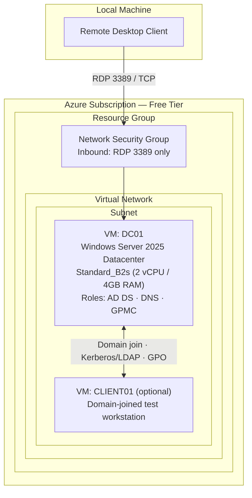
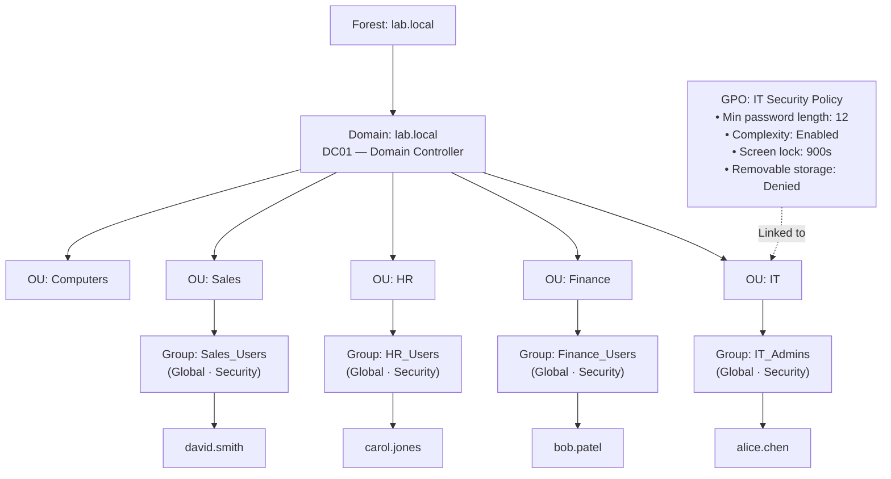

Readme · MD
# Lab 1 — Active Directory Domain Services on Windows Server 2025
 
**Identity & Access Management foundations, built from scratch on a free-tier Azure VM.**
 


 
| Field | Value |
|---|---|
| Certification alignment | CompTIA Network+ · Security+ · Azure Administrator |
| Platform | Windows Server 2025 Evaluation (180-day) on Azure Free Account |
| Time to complete | 3–5 hours across multiple sessions |
| Estimated cost | $0 — fully covered by free tiers and evaluation licences |
| Career relevance | IT Support · Sysadmin · Cloud Engineer · Security Analyst |
 
---
 
## Overview
 
Active Directory (AD) is the identity backbone of most enterprise Windows environments. It answers one question for every login, every file share, every printer: **who is allowed to do what?**
 
This lab builds a single-forest, single-domain Active Directory environment from the ground up — promoting a domain controller, structuring the directory with Organisational Units (OUs), creating role-based security groups, provisioning user accounts, and enforcing settings domain-wide with a Group Policy Object (GPO). It mirrors the exact tasks a Tier 1/2 IT support role or a junior sysadmin performs in a real enterprise, and maps directly onto Microsoft Entra ID (formerly Azure AD) concepts used in cloud engineering and security analyst roles.
 
| Role | How this lab applies |
|---|---|
| IT Support / Help Desk | Password resets, account unlocks, group membership changes — the top three ticket types in any enterprise |
| Sysadmin | Designing OU structure, deploying GPOs, managing domain-joined machines at scale |
| Cloud Engineer | Entra ID uses the same concepts — users, groups, roles, conditional access. On-prem AD knowledge transfers directly |
| Security Analyst | AD is the most targeted system in ransomware attacks. Understanding how it works is the foundation of defending it |
 
---
 
## Architecture
 
### Infrastructure layer (Azure)
 

 
### Logical layer (Active Directory)
 

 
**Design rationale:** access is granted through group membership, never to individual users directly — this is role-based access control (RBAC) applied at the identity layer. Removing a user from a group revokes access instantly and auditably; deleting an account is avoided in favour of disabling it, preserving the audit trail. Policy (GPO) is scoped to an OU rather than applied machine-by-machine, so security posture is enforced centrally and consistently as the environment scales.
 
---
 
## What You'll Learn
 
| Skill | Real-world application |
|---|---|
| Promote a Windows Server to Domain Controller | The first step in every enterprise Windows environment |
| Create Organisational Units (OUs) | Apply different policies to different departments from one place |
| Create users, groups, and group memberships | Every access decision in an enterprise is group-based |
| Configure Group Policy Objects (GPOs) | Enforce password policy, screen lock, and device restrictions domain-wide |
| Join a machine to the domain | Turn a workstation into a managed, policy-enforced resource |
| Configure role-based access with security groups | Principle of least privilege, applied practically |
| Reset passwords and manage account lifecycle | The most frequent real-world IT support task |
 
---
 
## Prerequisites
 
- A Microsoft account (for the Azure Free Account) — no existing Azure subscription required
- A local Remote Desktop client (built into Windows; [Microsoft Remote Desktop](https://apps.apple.com/app/windows-app/id1295203466) on macOS)
- Basic comfort with PowerShell and a Windows GUI
- *(Alternative path)* 8GB+ RAM locally if running the lab in VirtualBox instead of Azure — see [Option B](#option-b--run-locally-with-virtualbox)
---
 
## Step 1 — Provision the Environment
 
### Option A — Run in Azure (recommended)
 
No local hardware requirements — the VM runs in Microsoft's data centre and is reachable over RDP.
 
1. Create a free account at [azure.microsoft.com/free](https://azure.microsoft.com/free)
2. Sign in to [portal.azure.com](https://portal.azure.com)
3. Search **Virtual machines** → **Create**
4. Configure using the settings below → **Review + Create** → **Create**
| Setting | Value | Why |
|---|---|---|
| Region | East US | Cheapest region, most available VM sizes under free tier |
| Image | Windows Server 2025 Datacenter — Gen2 | Latest server OS, includes free 180-day evaluation licence |
| Size | Standard_B2s (2 vCPU, 4GB RAM) | Smallest size that runs AD comfortably; covered by free tier credits |
| Authentication | Password | Used to RDP in |
| Public inbound ports | Allow RDP (3389) | Required to connect from your local machine |
| OS disk | Standard SSD | Good performance, included in free tier storage |
 
> **Cost control:** a B2s VM costs roughly $0.05/hour. **Stop** (don't delete) the VM at the end of every session to pause compute billing — your $200 free credit lasts far longer this way.
 
**Fix clipboard sharing before connecting:** by default, RDP does not share your clipboard, so commands can't be pasted into the VM.
 
1. Open Remote Desktop on your local machine → enter the VM's public IP
2. **Show Options** → **Local Resources** tab → confirm **Clipboard** is checked under *Local devices and resources*
3. **Connect**
> If using the Azure portal's browser-based console, clipboard support is limited. Instead, use **Connect → Download RDP File** and open it with your native Remote Desktop app — this is the recommended approach for all lab work.
 
### Option B — Run locally with VirtualBox
 
1. Download [VirtualBox](https://virtualbox.org) (free, no account required)
2. Download the Windows Server 2025 Evaluation ISO from the [Microsoft Evaluation Center](https://www.microsoft.com/evalcenter)
3. Create a new VM: 4GB RAM minimum, 60GB disk, Windows Server type
4. Mount the ISO, boot, and select **Windows Server 2025 Datacenter with Desktop Experience** during setup
Minimum host requirements: 8GB RAM (4GB for the VM, 4GB for your OS), 60GB free disk space, quad-core CPU with virtualisation enabled in BIOS. Below 8GB RAM, use Option A instead.
 
---
 
## Step 2 — Install Active Directory Domain Services
 
RDP into the VM. Server Manager opens automatically on login.
 
**GUI path:** Server Manager → **Manage** → **Add Roles and Features** → Next through the wizard to **Server Roles** → check **Active Directory Domain Services** → **Add Features** when prompted → Next → **Install**. Wait 2–3 minutes, then **Close** — do not restart yet.
 
```powershell
# Install the AD DS role
Install-WindowsFeature -Name AD-Domain-Services -IncludeManagementTools
 
# Install the Group Policy Management Console now — Step 5 depends on it.
# Without this, "Group Policy Management" will not appear in the Tools menu.
Install-WindowsFeature -Name GPMC
```
 
> A Domain Controller (DC) is the server that runs Active Directory — the authoritative source that checks credentials whenever a user logs in anywhere on the domain. Enterprises typically run more than one for redundancy; this lab builds one.
 
---
 
## Step 3 — Promote the Server to a Domain Controller
 
Installing the role doesn't create a domain — promotion creates the **forest**, the **domain**, and makes this server the authoritative DNS and identity server for everything that joins it.
 
> A **Forest** is the top-level container of the entire AD structure — the organisation itself. A **Domain** is a management boundary inside the forest (ours is `lab.local`). Most small-to-medium organisations run one domain in one forest.
 
1. Server Manager → click the yellow warning flag → **Promote this server to a domain controller**
2. **Add a new forest** → Root domain name: `lab.local`
3. Set a DSRM password (record it securely — used only for disaster recovery)
4. Accept defaults on DNS Options and NetBIOS pages → **Install**
5. The server restarts automatically when complete
```powershell
# Alternative: promote via PowerShell
Import-Module ADDSDeployment
Install-ADDSForest `
  -DomainName 'lab.local' `
  -DomainNetBiosName 'LAB' `
  -InstallDns:$true `
  -SafeModeAdministratorPassword (ConvertTo-SecureString 'YourDSRMPassword!' -AsPlainText -Force) `
  -Force:$true
```
 
**Result:** `lab.local` now exists as a forest and domain. This server is the root domain controller, running DNS and authenticating every future domain join.
 
---
 
## Step 4 — Build the Organisational Structure
 
Open **Active Directory Users and Computers** (ADUC) from Server Manager's **Tools** menu.
 
> An **Organisational Unit (OU)** is a folder inside Active Directory used to group users, computers, and groups by department, location, or function. Its real power: a Group Policy linked to an OU applies automatically to everything inside it — IT gets one policy set, Finance another, HR another, all managed centrally.
 
```powershell
# Create all 5 OUs
New-ADOrganizationalUnit -Name "IT"        -Path "DC=lab,DC=local"
New-ADOrganizationalUnit -Name "Finance"   -Path "DC=lab,DC=local"
New-ADOrganizationalUnit -Name "HR"        -Path "DC=lab,DC=local"
New-ADOrganizationalUnit -Name "Sales"     -Path "DC=lab,DC=local"
New-ADOrganizationalUnit -Name "Computers" -Path "DC=lab,DC=local"
```
 
> A **Security Group** holds user accounts so that access is granted to the group, not to individuals one by one — role-based access control. Add 50 people to `Finance_Users` once instead of granting 50 individual permissions; remove someone from the group and every associated access is revoked at once.
 
```powershell
# Create all 4 security groups (Global scope, Security type)
New-ADGroup -Name "IT_Admins"     -GroupScope Global -GroupCategory Security -Path "OU=IT,DC=lab,DC=local"
New-ADGroup -Name "Finance_Users" -GroupScope Global -GroupCategory Security -Path "OU=Finance,DC=lab,DC=local"
New-ADGroup -Name "HR_Users"      -GroupScope Global -GroupCategory Security -Path "OU=HR,DC=lab,DC=local"
New-ADGroup -Name "Sales_Users"   -GroupScope Global -GroupCategory Security -Path "OU=Sales,DC=lab,DC=local"
```
 
> A **User Account** represents a person or service — username, password hash, group memberships, attributes. On login, the DC validates credentials and returns a token dictating exactly what the user can access, driven entirely by group membership.
 
Use a consistent naming convention (`firstname.lastname` is the enterprise standard).
 
```powershell
# Run this entire block together — not line by line.
# $password must be defined before New-ADUser runs, or PowerShell
# will prompt for -Name and the script will fail.
 
$password = ConvertTo-SecureString "Welcome@2026!" -AsPlainText -Force
 
New-ADUser -Name "alice.chen" -GivenName "Alice" -Surname "Chen" `
  -SamAccountName "alice.chen" -UserPrincipalName "alice.chen@lab.local" `
  -Path "OU=IT,DC=lab,DC=local" -AccountPassword $password -Enabled $true
 
New-ADUser -Name "bob.patel" -GivenName "Bob" -Surname "Patel" `
  -SamAccountName "bob.patel" -UserPrincipalName "bob.patel@lab.local" `
  -Path "OU=Finance,DC=lab,DC=local" -AccountPassword $password -Enabled $true
 
New-ADUser -Name "carol.jones" -GivenName "Carol" -Surname "Jones" `
  -SamAccountName "carol.jones" -UserPrincipalName "carol.jones@lab.local" `
  -Path "OU=HR,DC=lab,DC=local" -AccountPassword $password -Enabled $true
 
New-ADUser -Name "david.smith" -GivenName "David" -Surname "Smith" `
  -SamAccountName "david.smith" -UserPrincipalName "david.smith@lab.local" `
  -Path "OU=Sales,DC=lab,DC=local" -AccountPassword $password -Enabled $true
 
Add-ADGroupMember -Identity "IT_Admins"     -Members "alice.chen"
Add-ADGroupMember -Identity "Finance_Users" -Members "bob.patel"
Add-ADGroupMember -Identity "HR_Users"      -Members "carol.jones"
Add-ADGroupMember -Identity "Sales_Users"   -Members "david.smith"
```
 
> **Note:** the password above is a static lab placeholder for repeatability, not a real-world credential pattern — see [Security Considerations](#security-considerations--lessons-learned).
 
---
 
## Step 5 — Configure Group Policy
 
Open **Group Policy Management** from Server Manager's **Tools** menu (requires GPMC, installed in Step 2).
 
> A **Group Policy Object (GPO)** is a rulebook Windows enforces automatically on every user or computer inside a linked OU — no manual configuration per machine. Password rules, screen lock timers, USB restrictions, and software controls all originate from a single GPO, letting one organisation manage thousands of machines consistently.
 
1. Expand **Forest: lab.local → Domains → lab.local**
2. Right-click the **IT** OU → **Create a GPO in this domain, and link it here** → name it `IT Security Policy`
3. Right-click the GPO → **Edit** → configure the settings below
| Policy path | Setting | Value | Why |
|---|---|---|---|
| Computer Config → Windows Settings → Security → Account Policies → Password Policy | Minimum password length | 12 | Enforces strong passwords across IT accounts |
| Computer Config → Windows Settings → Security → Account Policies → Password Policy | Password must meet complexity requirements | Enabled | Requires upper, lower, number, and symbol |
| Computer Config → Windows Settings → Security → Local Policies → Security Options | Interactive logon: Machine inactivity limit | 900 seconds | Auto-locks screen after 15 minutes |
| Computer Config → Administrative Templates → System → Removable Storage Access | All removable storage classes: Deny all access | Enabled | Prevents data exfiltration via USB drives |
 
**Test the GPO:** join a second VM to `lab.local`, move its computer object into the **IT** OU, run `gpupdate /force`, log in as `alice.chen`, and confirm the screen lock policy takes effect.
 
---
 
## Step 6 — Common Help Desk Tasks
 
The top day-one tasks expected of any IT support role.
 
**Reset a password** (force a change at next login so the user sets their own):
 
```powershell
Set-ADAccountPassword -Identity "bob.patel" -Reset -NewPassword (ConvertTo-SecureString "NewPass@2026!" -AsPlainText -Force)
Set-ADUser -Identity "bob.patel" -ChangePasswordAtLogon $true
```
 
**Unlock a locked account** (accounts lock after repeated failed logins — one of the most frequent help desk calls):
 
```powershell
Unlock-ADAccount -Identity "carol.jones"
```
 
**Disable an account — employee offboarding** (disable, don't delete, to preserve history and group memberships for audit purposes):
 
```powershell
Disable-ADAccount -Identity "david.smith"
 
# Find all currently disabled accounts
Search-ADAccount -AccountDisabled | Select-Object Name, SamAccountName
```
 
**Audit and reporting**:
 
```powershell
# Accounts inactive for 90+ days
$cutoff = (Get-Date).AddDays(-90)
Get-ADUser -Filter {LastLogonDate -lt $cutoff -and Enabled -eq $true} -Properties LastLogonDate |
  Select-Object Name, LastLogonDate
 
# Group membership for a specific user
Get-ADPrincipalGroupMembership -Identity "alice.chen" | Select-Object Name
```
 
---
 
## Verification
 
| Check | Command | Expected result |
|---|---|---|
| Domain controller is running | `Get-ADDomainController` | Returns DC info including forest `lab.local` |
| OUs exist | `Get-ADOrganizationalUnit -Filter *` | Lists all 5 OUs created |
| Users exist and are enabled | `Get-ADUser -Filter {Enabled -eq $true}` | Lists the 4 test accounts |
| Group memberships correct | `Get-ADGroupMember -Identity IT_Admins` | Returns `alice.chen` |
| GPO is linked | `Get-GPInheritance -Target 'OU=IT,DC=lab,DC=local'` | Shows `IT Security Policy` as linked |
 
---
 
## Troubleshooting
 
| Problem | Fix |
|---|---|
| PowerShell prompts for `Name:` when creating users | `New-ADUser` ran before `$password` was defined. Run the entire Step 4 script block together, `$password` first. |
| Cannot copy and paste into the VM | RDP client → **Show Options** → **Local Resources** → check **Clipboard**, reconnect. Or download the RDP file from the Azure portal and open it with the native Remote Desktop app. |
| Promotion fails: DNS conflict | Set the NIC's preferred DNS to `127.0.0.1` before promoting, or use the VM's static IP. |
| Cannot RDP after domain join | Log in as `LAB\Administrator` (domain admin), not local `Administrator`. |
| GPO not applying | Run `gpupdate /force` on the target machine, then `gpresult /r` to confirm applied policies. |
| User cannot log in after creation | Confirm the account is `Enabled` and `ChangePasswordAtLogon` is set correctly. |
| AD Users and Computers not showing | Run `dsa.msc` from the Run dialog, or `Add-WindowsFeature RSAT-ADDS`. |
 
---
 
## Security Considerations & Lessons Learned
 
- **Least privilege via groups, not individuals.** Every access grant in this lab flows through a security group. This is the pattern to default to in production — direct-to-user permissions don't scale and are hard to audit.
- **Disable, don't delete, on offboarding.** Preserves the audit trail and avoids orphaning resources (mailboxes, file ownership, SIDs referenced elsewhere) tied to a deleted SID.
- **AD is a primary ransomware target.** Compromising a Domain Controller compromises every downstream trust decision. In a production build-out, next steps would include: tiered administration (no domain admin logons on workstations), LAPS for local admin password rotation, and Microsoft Defender for Identity or equivalent for DC-level threat detection.
- **The DSRM password and lab account password are placeholders.** `Welcome@2026!` is used here for repeatable, scriptable lab setup only — in any real environment, static shared passwords and predictable patterns are a finding, not a practice. Pair with `ChangePasswordAtLogon` (used above) or an automated secrets/password manager.
- **GPO scoping mirrors org structure.** Policy was linked at the OU level (IT) rather than applied ad hoc, which is what makes policy enforcement consistent and auditable as headcount grows.
- **Cost hygiene matters in cloud labs too.** Stopping (not deleting) the VM between sessions is a small habit that reflects real-world cost governance discipline, not just a lab convenience.
---
 
## Repository Structure
 
```
.
├── README.md
├── screenshots/
│   ├── 01-vm-provisioning.png
│   ├── 02-adds-role-install.png
│   ├── 03-domain-promotion.png
│   ├── 04-ou-structure.png
│   ├── 05-users-groups.png
│   ├── 06-gpo-configuration.png
│   └── 07-verification-output.png
└── scripts/
    ├── create-ous.ps1
    ├── create-groups.ps1
    ├── create-users.ps1
    └── verification.ps1
```
 
> Screenshots and the extracted PowerShell scripts referenced above are recommended additions to this repo — they turn this README from a writeup into verifiable evidence of the build.
 
---
 
**Author:** Betredawit Arega
**Lab environment:** Azure Free Account · Windows Server 2025 Datacenter · PowerShell 5.1
 


